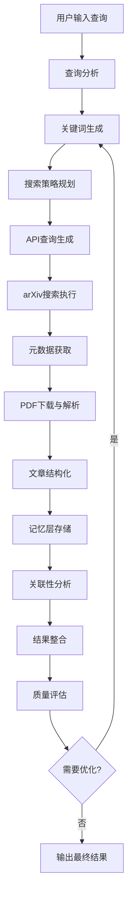

# Library Index 智库索引项目文档

## 项目概述

Library Index（智库索引）是一个基于AI的科研文献自动化查询系统。该项目利用大型语言模型（LLM）将传统检索过程分解为多个步骤，通过智能代理主动执行检索和分析任务。

### 核心特性

- **智能文献检索**: 基于用户查询自动生成搜索策略
- **多源数据集成**: 主要支持arXiv学术数据库
- **自适应搜索**: 根据搜索结果质量动态调整策略
- **内容结构化**: 将学术论文转换为向量友好的结构化提示词
- **记忆层缓存**: 使用mem0作为缓存记忆层，避免重复处理
- **智能信息整合**: 采用二叉树合并算法整合多个分析结果

## 系统架构

### 整体架构

```
Library Index/
├── src/                    # 源代码目录
│   ├── application/        # 应用层
│   │   ├── app.py         # FastAPI Web服务
│   │   └── test.py        # 测试文件
│   ├── domains/           # 领域层（核心业务逻辑）
│   │   ├── orchestrator.py    # 智能研究代理编排器
│   │   ├── academicDB_rag.py  # 学术数据库RAG抽象类
│   │   ├── article_process.py # 文章结构化处理器
│   │   └── ADB_rag/           # arXiv特定实现
│   ├── infrastructure/     # 基础设施层
│   │   ├── llm_client.py      # LLM客户端抽象
│   │   ├── memory_layer.py    # 记忆层封装
│   │   ├── pdf_parser.py      # PDF解析器
│   │   └── ADB_providers/     # 学术数据库提供商
│   └── adapters/          # 适配器层（预留）
├── docs/                  # 文档目录
├── tests/                 # 测试目录
└── 配置文件
```

### 核心组件

#### 1. 智能研究代理 (IntelligentResearchAgent)

位于 `src/domains/orchestrator.py:140`，是系统的核心组件。

**主要功能：**
- 状态驱动的任务执行
- 自适应搜索策略优化
- 并发论文处理
- 智能信息整合

**状态机设计：**
```python
class AgentState(Enum):
    INITIALIZING      # 初始化
    ANALYZING_QUERY   # 查询分析
    PLANNING_SEARCH   # 搜索规划
    EXECUTING_SEARCH  # 搜索执行
    PROCESSING_RESULTS # 结果处理
    EVALUATING_RESULTS # 结果评估
    REFINING_STRATEGY # 策略优化
    SYNTHESIZING      # 信息整合
    COMPLETED         # 完成
    ERROR             # 错误
```

#### 2. 学术数据库RAG (AcademicDBRAG)

位于 `src/domains/academicDB_rag.py:13`，提供学术数据库访问的抽象接口。

**设计模式：** 注册器模式，支持多数据库提供商扩展

**核心方法：**
- `api_coding(request: str) -> List[str]`: 将用户查询转换为API搜索字符串

#### 3. 文章结构化处理器 (ArticleStructuring)

位于 `src/domains/article_process.py:99`，负责将学术论文转换为结构化提示词。

**处理流程：**
1. 文档分块（6000字符/块）
2. 双语提示词生成（中英文）
3. 结构化信息提取
4. 向量友好格式化

#### 4. LLM客户端抽象 (LLMClient)

位于 `src/infrastructure/llm_client.py:13`，提供统一的LLM访问接口。

**支持的提供商：**
- DeepSeek
- Qwen
- 可扩展其他OpenAI兼容API

#### 5. 记忆层 (Mem0Client)

位于 `src/infrastructure/memory_layer.py:66`，封装mem0 SDK提供记忆功能。

**核心功能：**
- 论文分析结果缓存
- 图谱和向量存储
- 元数据搜索
- 健康检查机制

## 工作流程

### 1. 查询处理流程



### 2. 智能搜索优化

**搜索质量评估指标：**
- 找到论文数量
- 处理成功率
- 搜索效率

**优化策略：**
- 扩展关键词范围
- 精炼关键词相关性
- 尝试相关领域术语
- 基于历史执行记录避免重复搜索

### 3. 信息整合算法

采用二叉树合并算法进行智能信息整合：

```python
def _intelligent_synthesis_merge(self, results: List[str]) -> str:
    # 1. 过滤无效内容
    # 2. 二叉树成对合并
    # 3. 动态token分配
    # 4. 并行处理
    # 5. 递归整合直到单一结果
```

## 技术栈

### 核心依赖

- **Web框架**: FastAPI + Uvicorn
- **LLM集成**: OpenAI兼容API
- **记忆层**: mem0ai + Neo4j
- **文档处理**: PyMuPDF + Docling + EasyOCR
- **并发处理**: ThreadPoolExecutor
- **配置管理**: Pydantic + python-dotenv

### 关键库版本

```
requests>=2.32.0,<3.0
openai>=1.33.0,<2.0
mem0ai[graph]>=0.1.0,<0.2.0
neo4j>=5.20.0,<6.0
fastapi>=0.111.0,<1.0
pymupdf>=1.26.3,<2.0.0
docling>=2.43.0,<3.0.0
```

## API接口

### Web API端点

```python
POST /research
```

**请求参数：**
```python
class InputModel(BaseModel):
    interface: str                           # 交互接口类型
    raw_message_process_llm: str            # 查询处理LLM
    raw_message_process_llm_model: str       # 查询处理模型
    api_generate_llm: str                   # API生成LLM
    api_generate_llm_model: str             # API生成模型
    embedding_llm: str                      # 嵌入LLM
    embedding_llm_model: str               # 嵌入模型
    max_workers_llm: int = 8                # 最大并发数
    max_search_retries: int = 2             # 最大搜索重试次数
```

**响应格式：**
```python
class OutputModel(BaseModel):
    result: str    # 研究结果
```

## 配置说明

### 环境变量

项目支持两种配置文件：
- `.public.env`: 公共配置
- `.private.env`: 私有配置（API密钥等）

### 关键配置项

```
MEM0_BASE_URL=https://api.mem0.ai
MEM0_API_KEY=your_api_key_here
```

## 部署说明

### 环境准备

1. **Python环境**: Python 3.8+
2. **依赖安装**: `pip install -r requirements.txt`
3. **环境配置**: 复制并配置 `.public.env` 和 `.private.env`

### 启动服务

```bash
# 开发模式
python -m uvicorn src.application.app:app --reload

# 生产模式
uvicorn src.application.app:app --host 0.0.0.0 --port 8000
```

## 扩展开发

### 添加新的LLM提供商

1. 继承 `LLMClient` 抽象类
2. 实现必需方法：`chat_completion`, `_health_check`, `_post`, `find_connect`
3. 使用 `@LLMClient.register("provider_name")` 装饰器注册

### 添加新的学术数据库

1. 继承 `AcademicDBRAG` 抽象类
2. 实现 `api_coding` 方法
3. 使用 `@AcademicDBRAG.register("db_name")` 装饰器注册

### 自定义交互接口

1. 在 `src/infrastructure/IO_templates/` 下创建新的接口类
2. 继承基础接口类并实现输入输出方法
3. 在 `IOStream.create()` 中注册新接口

## 性能优化

### 并发处理

- **LLM调用**: 使用 `ThreadPoolExecutor` 并发处理
- **论文分析**: 支持最多8个并发worker
- **信息整合**: 二叉树合并算法支持并行处理

### 缓存策略

- **记忆层缓存**: 使用mem0缓存已分析的论文
- **去重机制**: 基于论文ID避免重复处理
- **智能过滤**: 过滤无效和无意义的内容

### 速率限制

- **arXiv API**: 严格遵循3秒间隔限制
- **LLM API**: 根据提供商限制调整并发数

## 监控与日志

### 执行记录

系统记录完整的执行历史，包括：
- 状态转换
- 搜索尝试
- 处理结果
- 错误信息

### 健康检查

- **mem0连接**: 启动时执行读写测试
- **LLM服务**: 定期健康检查
- **API响应**: 监控响应时间和成功率

## 常见问题

### Q: 如何处理搜索结果为空的情况？

A: 系统会自动进行策略优化，包括：
1. 扩展搜索关键词
2. 尝试相关领域术语
3. 调整搜索策略
4. 最多重试3次

### Q: 记忆层的作用是什么？

A: 记忆层用于：
1. 缓存已分析的论文，避免重复处理
2. 存储结构化的学术信息
3. 支持快速检索和关联分析
4. 提供图谱和向量搜索能力

### Q: 如何提高搜索质量？

A: 可以通过以下方式：
1. 提供更具体的查询关键词
2. 调整LLM模型参数
3. 增加搜索重试次数
4. 优化并发处理参数

## 贡献指南

1. Fork项目仓库
2. 创建功能分支
3. 提交代码变更
4. 创建Pull Request
5. 等待代码审查

## 许可证

本项目采用MIT许可证，详见LICENSE文件。

## 联系方式

如有问题或建议，请通过以下方式联系：
- GitHub Issues
- Email: [your-email@example.com]